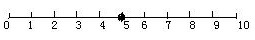

#动态规划 

## 题目描述

都说天上不会掉馅饼，但有一天gameboy正走在回家的小径上，忽然天上掉下大把大把的馅饼。说来gameboy的人品实在是太好了，这馅饼别处都不掉，就掉落在他身旁的10米范围内。馅饼如果掉在了地上当然就不能吃了，所以gameboy马上卸下身上的背包去接。但由于小径两侧都不能站人，所以他只能在小径上接。由于gameboy平时老呆在房间里玩游戏，虽然在游戏中是个身手敏捷的高手，但在现实中运动神经特别迟钝，每秒种只有在移动不超过一米的范围内接住坠落的馅饼。现在给这条小径如图标上坐标：


为了使问题简化，假设在接下来的一段时间里，馅饼都掉落在0-10这11个位置。开始时gameboy站在5这个位置，因此在第一秒，他只能接到4,5,6这三个位置中其中一个位置上的馅饼。问gameboy最多可能接到多少个馅饼？（假设他的背包可以容纳无穷多个馅饼)

## Input

输入数据有多组。每组数据的第一行为以正整数n(0<n<100000)，表示有n个馅饼掉在这条小径上。在结下来的n行中，每行有两个整数x,T(0<T<100000),表示在第T秒有一个馅饼掉在x点上。同一秒钟在同一点上可能掉下多个馅饼。n=0时输入结束。

## Output

每一组输入数据对应一行输出。输出一个整数m，表示gameboy最多可能接到m个馅饼。
提示：本题的输入数据量比较大，建议用scanf读入，用cin可能会超时。

## 输入样例

```text
6
5 1
4 1
6 1
7 2
7 2
8 3
0
```

## 输出样例

```text
4
```

## 题解

类似于数塔问题，利用dp[i][j]表示第j秒位于i位置时能得到的最大馅饼数，状态转移方程为dp[i][j]=dp[i][j]+max(dp[i-1][j+1], dp[i][j+1], dp[i+1][j+1])，最终答案即为dp[5][0]的值。
注意本题数组太大，不能在函数内部定义。

```c++
#include <bits/stdc++.h>
using namespace std;
int dp[11][100000];
int main()
{
    int n,x,t,maxt,maxd;
    while(scanf("%d",&n),n)
    {
        maxt=0;
        memset(dp,0,sizeof(dp));
        for(int i=0;i<n;i++)
        {
            scanf("%d%d",&x,&t);
            dp[x][t]++;
            if(t>maxt)maxt=t;
        }
        for(int i=maxt-1;i>=0;i--)
        {
            dp[0][i]+=(dp[0][i+1]<dp[1][i+1]?dp[1][i+1]:dp[0][i+1]);//边界特判
            for(int j=1;j<10;j++)
            {
                maxd=0;
                for(int k=j-1;k<=j+1;k++)
                    if(dp[k][i+1]>maxd)maxd=dp[k][i+1];
                dp[j][i]+=maxd;
            }
            dp[10][i]+=(dp[9][i+1]<dp[10][i+1]?dp[10][i+1]:dp[9][i+1]);//边界特判
        }
        printf("%d\n",dp[5][0]);
    }
    return 0;
}
```