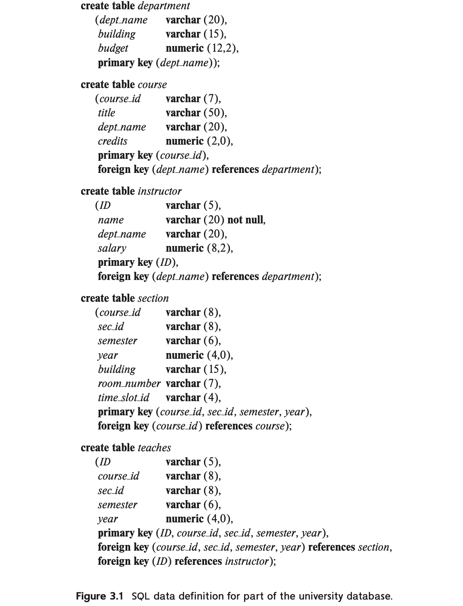

# 概念

SQL(Structured Query Language)，结构化查询语言，包括以下几个部分：

- 数据定义语言(Data-Definition Language, DDL)：定义关系模式、删除关系、修改关系模式
- 数据操纵语言(Data-Manipulation Language, DML)：数据查询、元组级别的插入、删除和修改
- 完整性(intergrity)
- 视图定义(view definition)
- 事物控制(transaction control)
- 嵌入式SQL和动态SQL(embedded SQL and dynamic SQL)：定义SQL语句如何嵌入到C、Java等通用编程语言
- 授权(authorization)：控制对关系和视图的访问权限

# 关系创建



## 数据类型

- char(n)：长度固定的字符串，不足会用空格填补
- varchar(n)：长度可变的字符串，但有最大长度限制
- int
- smallint：小整数类型
- numeric(p, d)：定点数，p表示总共有几位数字，d表示小数部分的位数
- real, double precision：浮点数和双精度浮点数
- float(n)：精度至少为n位的浮点数
- null：表示该值不存在

## 模式定义

```sql
create table r
	(A1 D1,-- 属性名、域
     A2 D2,
     ...
     An Dn,
     <完整性约束>
     ...);
```

## 完整性约束

- primary key($A_1,A_2,\dots,A_n$)：表示这些属性构成关系的主码。这隐含了主码属性必须非空且唯一的要求。
- foreign key($A_1,A_2,\dots,A_n$) references $r$：表示这些属性关联到关系$r$。这隐含了这些属性的取值必须在关系$r$的主键中存在。
- not null：在定义属性的域时加以标注，显式地要求变量必须存在。
- check(P)：要求每个元组都要满足要求P。
- unique($A_1,A_2,A_3,\dots,A_n$)：表明关系中的任何元组，在所有这些属性上的值都唯一。

# 数据查询

基本形式：


表示从关系$r_1,r_2,\dots,r_m$的笛卡尔积中筛选出满足$P$的元组，再将这些元组投影到属性$A_1,A_2,\dots,A_n$上。

- $select$语句：

  - 可以用\*号表示选择所有属性。
  - $distinct$表示去除重复，$all$表示不去除重复(默认)。
  - 可以直接进行+、-、*、/的运算。

- $from$语句：

- $where$语句：

  - 可以省略。

  - 可以使用=、<、>、<=、>=、<>（不等于）

  - 还可以使用between...and语句，如：

    ```sql
    select name
    from instructor
    where salary between 90000 and 100000;
    -- 可以取代：
    where salary <= 100000 and salary >= 90000
    ```

  - 不同的条件之间用and、or连接

## 连接

- 自然连接natural join

- 指定自然连接中哪些列相等：

  a join b using(a1,a2)

- 指定连接条件：

  a join b on ...

```sql
from student natural join takes
from student join takes using(ID)
from student join takes on student.ID = takes.ID
```

## 外连接

在上面连接的基础上，可以选择保留未匹配的元组，空缺值会用null填充。为了区分，前面的不保留未匹配元组的连接称作内连接(inner join)，关键字inner可以省略。

- 左外连接(left outer join)：保留左边关系中未匹配的元组
- 右外连接(right outer join)：保留右边关系中未匹配的元组
- 全外连接(full outer join)：保留两边关系中未匹配的元组

```sql
-- 获取所有学生的选课信息，包括没有选任何课的学生
select *
from student natural left outer join takes;
```

## 重命名

```sql
-- oldname as newname，如：
select T.name, S.course_id
from instructor as T, teaches as S
where T.ID = S.ID;
```

select和from语句中都可以使用。

## 排序

order by语句可以将查询到的结果进行排序。desc表示降序，asc表示升序。

## 聚集函数

对数据集进行某些统计运算，如：

- avg
- min
- max
- sum
- count

## 分组

group by语句将元组按条件进行分组。使用group by语句后select语句中只允许出现分组属性，没有用于分组的属性除非用聚集函数转化为单个值，否则不允许出现在select语句中。

having语句对分组进行筛选。作为对比，where语句对元组进行筛选。

```sql
select dept_name, avg(salary) as avg_salary
from instructor
group by dept_name
having avg(salary) > 42000;
```

## 空值

- 可以用is null、is not null判断是否为空值
- 在distinct操作中，两个空值视为相同
- 在<、>、=等比较运算中，只要两边有一个值为空，则返回unknown。select-from-where运算中结果为unknown的元组不会出现在结果中。

## 执行顺序

1. 根据from语句进行笛卡尔积的操作。
2. 根据where语句对元组进行筛选。
3. 利用group by语句进行分组（如果有）。
4. 根据having语句对分组进行筛选（如果有）。
5. 执行select语句。
6. 根据order by语句进行排序（如果有）。

# 表关联查询

## 集合运算

- union：并运算，自动去重，若要保留重复需要使用union all
- intersect：交运算，自动去重，若要保留重复需要使用intersect all
- except：差运算，自动去重，若要保留重复需要使用except all

## 嵌套查询

一个select语句得到的结果可以作为另一个select语句的条件。

## in

in后面可以是某个select语句，也可以直接给出该集合，如：

in ('Fall', 'Winter', 'Spring', 'Summer')

## some、all

## exists

用not exists语句模拟集合的包含操作：

```sql
-- 查找选修了生物系开设的所有课程的学生
select S.ID, S.name
from student as S
where not exists((select course_id
                  from course
                  where dept_name = 'Biology')
                  except
                 (select T.course_id
                  from takes as T
                  where S.ID = T.ID));
```

也就是用小的集合减去大的集合，如果得到的结果为空，表示小集合属于大集合。

## unique

检测集合中是否存在重复的元组。not unique检测集合中是否存在重复的元组。注意当存在空值时，由于null = null返回值为unknown，因此即使这个元组重复出现，unique的计算结果可能仍然为真。

# 数据修改

## 插入元组

```sql
-- 按建立关系时的属性顺序插入一个元组
insert into r
	values(a,b,c);
	
-- 指定属性的顺序
insert into r(A1,A2,A3)
	values(a,b,c)
	
-- 批量插入
insert into r
	select ...
	from ...
	where ...;
```

## 更新元组

```sql
update instructor
set salary = salary * 1.05
where salary < 70000;
```

## 删除元组

```sql
-- 把一个表清空，但该表依然存在
delete from r;

-- 删除r中满足P的元组
delete from r
where P;
```

## 增加、删除属性

```sql
-- 添加名为A，域为D的属性
alter table r add A D;

-- 删除属性A
alter table r drop A;
```

## 删除表

```sql
drop table r;-- 把一个表清空，同时表也不再保留。
```

# 视图

## 视图创建

create view v as \<query expression\>

## 物化视图

